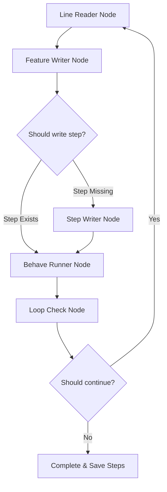

# AgenticQA 🤖🧪

> **Autonomous, Self-Correcting BDD Test Generation & Execution powered by LangGraph, Behave, and Gemini.**

AgenticQA is a state-of-the-art, AI-driven automation framework that bridges the gap between natural-language test cases and robust, executed Gherkin specifications. Instead of relying on static, brittle element locators and pre-written step definitions, AgenticQA uses **LangGraph** orchestration and **Gemini GenAI** to autonomously parse English text, translate it to Gherkin features, generate missing step code on-the-fly using the live compressed browser DOM, execute tests, and permanently retain custom step definitions.

---

## Demo

<p align="center">

</p>


## 🌟 Core Features

- **Autonomous Gherkin Compiler**: Takes a raw, plain-English list of instructions (`test_input.txt`) and automatically converts them to structured Gherkin scenario features.
- **Dynamic DOM-Aware Code Generation**: When a step definition is missing, Gemini inspects a token-efficient, minified version of the active page DOM to write optimal, contextual Selenium selector logic in real time.
- **Robust Multi-Strategy Interactions**: Built-in standard actions (like `i_clicked_method_selector`) prioritize native Selenium `.click()` actions to ensure natural event bubbling, with automated fallbacks to JavaScript executors if elements are obscured.
- **Interactive Step Preservation**: After a successful test run, the CLI detects any custom step definitions generated in `generated.py` and prompts the user to permanently append them into `core.py` for instant future auto-reuse.
- **Stateful Orchestration**: Built entirely on **LangGraph**, compiling a structured state machine that guarantees execution order (Line Reading ➔ Gherkin Generation ➔ Selector Writing ➔ Behave Execution ➔ Loop Progression).
- **Multi-Platform Capabilities**: Pre-configured to support both desktop Chrome browser testing (Selenium Webdriver) and mobile Android testing (Appium).

---

## 📐 Architecture Flow

AgenticQA uses a circular, stateful graph compiled via **LangGraph**. The workflow progresses sequentially through each plain-English line of the test script:



---

## 📂 Project Structure

```text
AgenticQA/
├── agents/
│   ├── feature_writer.py    # Translates unstructured English to Gherkin
│   ├── step_writer.py       # Writes dynamic python steps using page source JSON
│   └── llm.py               # Configures the Gemini GenAI model client
├── bdd/
│   ├── config/
│   │   └── caps.json        # Platform capabilities configuration (Web/Mobile)
│   ├── features/
│   │   └── test_cases.feature # Autogenerated Gherkin feature file
│   ├── steps/
│   │   ├── core.py          # Permanent base & user-approved step definitions
│   │   └── generated.py     # Sandbox for temporary, runtime-generated steps
│   ├── environment.py       # Driver configurations, options, and page-source hooks
│   └── page_source.html     # Active page raw source dump during steps
├── graph/
│   ├── state.py             # AgentState TypedDict schema
│   ├── nodes.py             # LangGraph state machine node operations
│   └── edges.py             # State machine routing & conditional checks
├── utils/
│   ├── source_compressor.py # Compresses verbose raw HTML into minified JSON
│   └── validator.py         # Static code analysis to check for existing steps
├── main.py                  # Project entrypoint, graph orchestrator, and cli
├── pyproject.toml           # Project dependencies managed via UV or pip
└── test_input.txt           # File containing plain-English instructions
```

---

## 🚀 Getting Started

### Prerequisites

- **Python**: `>= 3.11`
- **Chrome Browser**: Installed locally (Selenium Manager will automatically fetch the matching WebDriver binary)
- **Google Cloud SDK**: Installed and configured on your machine.
- **Application Default Credentials (ADC)**: Configured on your system.

### 1. Installation

Clone this repository to your local system and navigate to the directory:

```bash
git clone https://github.com/your-username/AgenticQA.git
cd AgenticQA
```

It is highly recommended to manage the virtual environment and dependencies using [uv](https://github.com/astral-sh/uv):

```bash
# Create virtual environment and install dependencies
uv venv
uv pip install -r pyproject.toml
```

Alternatively, you can use standard pip:

```bash
pip install -r pyproject.toml
```

### 2. Authentication & Configuration

The framework supports both enterprise Google Cloud Vertex AI (via ADC) and direct developer Google GenAI API Keys. Choose the configuration that matches your environment:

#### Option A: Enterprise Google Cloud Vertex AI (Default)
This is the default configuration set up in `agents/llm.py`, leveraging Vertex AI and authenticating via **Application Default Credentials (ADC)**.

1. Authenticate your local environment with Google Cloud by running:
   ```bash
   gcloud auth application-default login
   ```
2. Create a `.env` file in the root of the project directory and specify your GCP Project ID and Region:
   ```env
   GOOGLE_CLOUD_PROJECT_ID="your-gcp-project-id"
   GOOGLE_CLOUD_LOCATION="your-gcp-region" # e.g., us-central1
   ```

#### Option B: Developer Google GenAI API Key (Alternative)
If you prefer to run locally using a standalone Gemini API Key:

1. Modify the initialization inside `agents/llm.py` to omit Vertex parameters:
   ```python
   # Inside agents/llm.py, modify self.client initialization:
   self.client = genai.Client()  # Automatically picks up GEMINI_API_KEY from your environment
   ```
2. Create a `.env` file in the root of the project directory and supply your developer key:
   ```env
   GEMINI_API_KEY="your_actual_gemini_api_key_here"
   ```

### 3. Automated / Headless Execution (Optional)

If you wish to run AgenticQA automatically (e.g., inside container environments, CI/CD pipelines, or as background tasks), you can pass standard environment switches to toggle headless browsers or automated step preservation without human interaction:

* **Headless Browser Execution**:
  Set `HEADLESS=true` to run Chrome entirely in the background (without popping open a visual desktop window):
  ```bash
  # Windows Powershell
  $env:HEADLESS="true"
  python main.py

  # macOS/Linux Bash
  HEADLESS=true python main.py
  ```

* **Non-Interactive Step Preservation**:
  Set `AUTO_PERSIST` to bypass the final interactive terminal prompt (`y/n`) and automatically commit or ignore newly written steps:
  * `AUTO_PERSIST=true`: Automatically appends newly generated step definitions into `bdd/steps/core.py`.
  * `AUTO_PERSIST=false`: Safely discards/skips saving custom step definitions.
  
  ```bash
  # Example: Running fully automated, headlessly, and auto-discarding steps
  # Windows Powershell
  $env:HEADLESS="true"
  $env:AUTO_PERSIST="false"
  python main.py

  # macOS/Linux Bash
  HEADLESS=true AUTO_PERSIST=false python main.py
  ```

---

## 🛠️ Usage Guide

### Step 1: Supply English Test Instructions

Open `test_input.txt` and write your manual testing instructions sequentially. For example:

```text
Open the https://www.saucedemo.com/ in chrome
Type standard_user in Username
Type secret_sauce in Password
Click on the Login button
Click on the Add to cart button for Sauce Labs Backpack
Click on the Shopping Cart container
Click on the Checkout button
```

### Step 2: Launch the Agentic Pipeline

Run the framework orchestrator:

```bash
python main.py
```

The terminal will print detailed, colored logs of the internal state transitions:
1. **`[LineReader]`** grabs a step.
2. **`[FeatureWriter]`** maps it to Gherkin utilizing the current active DOM schema.
3. **`[StepWriter]`** writes the code to `generated.py` if the step is custom.
4. **`[BehaveRunner]`** launches Behave, clicks the buttons, updates the state, and captures the fresh DOM page source.
5. Repeat for all lines.

### Step 3: Permanently Persist Step Definitions

At the end of the run, the framework will analyze any newly generated custom python methods. You will see a prompt:

```text
==================================================
💾 CUSTOM STEP DEFINITIONS DETECTED
==================================================
The following custom step definitions were generated during this run:
--------------------------------------------------
@when('I clicked on the Add to cart button')
def step_impl(context):
    ...
--------------------------------------------------
Would you like to append these functions permanently to core.py? (y/n): 
```

Typing `y` or `yes` automatically appends these steps to `bdd/steps/core.py`. On subsequent runs, AgenticQA will recognize that these steps are already implemented and will instantly skip code generation, optimizing execution speed!

---

## 🧠 Under the Hood

### Token-Optimized DOM Compression
Parsing an entire, raw, verbose HTML document with hundreds of lines of styling, scripts, and layout nodes is token-expensive and introduces noise for the LLM. 

Our custom `source_compressor.py` uses **BeautifulSoup** to scan the raw HTML, strip headers, scripts, visual styles, and empty elements, and builds a compressed JSON index containing only actionable elements:
- Inputs (`input`, `textarea`)
- Buttons and clickable wrappers (`button`, `a`, certain `div` containers)
- Essential attributes (`id`, `name`, `placeholder`, `class`, text contents)

This reduces the context size by **up to 95%**, optimizing token usage and dramatically increasing Gemini's locator accuracy.

### Fallback Event Bubbling
Standard JavaScript execution overrides via `arguments[0].click()` on wrapper classes can suppress native pointer click bubble events, resulting in failed page redirections. AgenticQA implements a dynamic clicking protocol inside `core.py`:
1. Attempt native Selenium `.click()` to simulate genuine user mouse input.
2. If intercepted or obscured, automatically rescue the execution by firing a JavaScript `click()` executor.

---

## 📜 License 

Distributed under the MIT License. See [`LICENSE`](LICENSE) for more information.

